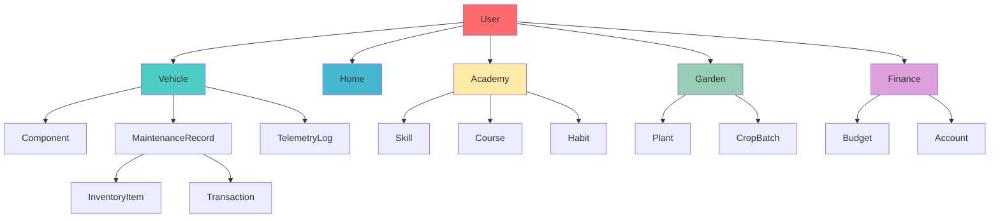

# LifeOS: Complete Vision and Frontend Integration Guide

## Executive Summary

LifeOS is a comprehensive personal and family management system built on Domain-Driven Design principles, featuring a graph-first architecture with ArangoDB at its core. The system encompasses eight interconnected domains that work together to provide a unified view of life management, from vehicle maintenance to personal development.

## System Vision

### Core Philosophy

LifeOS is designed to be the **operating system for life**, providing:
- **Unified Data Model**: All data interconnected through ArangoDB graph relationships
- **Domain-Driven Architecture**: Each domain represents a distinct area of life management
- **Type Safety**: F# domain models with TypeScript frontend contracts
- **Real-time Insights**: Live telemetry and predictive analytics
- **Family-Centric**: Multi-user support with role-based access

### The Eight Domains

```
┌─────────────────────────────────────────────────────────────┐
│                        LifeOS Ecosystem                     │
├─────────────────────────────────────────────────────────────┤
│  🎓 Academy    📊 Boardroom    🥋 Dojo    💰 Finance       │
│  Learning     Strategy       Growth    Money              │
│                                                             │
│  🚗 Garage     🌱 Garden       🏠 Home    📦 Inventory     │
│  Vehicles     Cultivation    Family    Assets             │
└─────────────────────────────────────────────────────────────┘
```

## Domain Interconnections

### Graph Relationship Overview



### Cross-Domain Workflows

1. **Vehicle Maintenance Flow**
   - Garage creates service record
   - Consumes parts from Inventory
   - Records transaction in Finance
   - Notifies user via Boardroom KPIs

2. **Learning to Growth Flow**
   - Academy tracks skill development
   - Updates habits in Dojo
   - Reflects in Boardroom objectives
   - Influences Home scheduling

3. **Garden to Table Flow**
   - Garden tracks crop batches
   - Updates Inventory with harvest
   - Impacts Finance budgets
   - Schedules Home meals

## Frontend Architecture

### Technology Stack

- **Framework**: Deno Fresh 2.x with Islands Architecture
- **Styling**: Tailwind CSS v4 + DaisyUI v5
- **Type Safety**: TypeScript contracts from F# domain types
- **Database**: ArangoDB with ArangoJS client
- **Deployment**: Podman containers with Quadlet

### Domain-Driven Frontend Structure

```
frontends/
├── garage/          # Vehicle management
├── academy/         # Learning system
├── garden/          # Garden management
├── finance/         # Financial tracking
├── home/            # Household management
├── dojo/            # Personal development
├── boardroom/       # Executive dashboard
└── inventory/       # Asset tracking
```

## Garage Domain: Complete Implementation

### Current State Analysis

The Garage frontend is the most mature domain, serving as the reference implementation for other domains.

#### ✅ Strengths
- Fresh 2.x with Islands Architecture
- TypeScript contracts aligned with F# domain
- Docker/Podman deployment ready
- Basic CRUD operations implemented
- VIN lookup integration

#### 🔧 Enhancement Opportunities

1. **Graph Integration**
   - Direct ArangoDB connections for complex queries
   - Visual relationship explorer
   - Graph-based maintenance history

2. **Real-time Features**
   - WebSocket telemetry streaming
   - Live maintenance updates
   - Predictive maintenance alerts

3. **Cross-Domain Integration**
   - Parts consumption from Inventory
   - Cost tracking in Finance
   - User permissions from Identity

### Enhanced Garage Architecture

```typescript
// Enhanced contracts with graph relationships
interface Vehicle {
  id: string;
  vin: string;
  // ... base properties
  
  // Graph relationships
  components?: Component[];
  maintenanceHistory?: MaintenanceRecord[];
  telemetry?: TelemetryLog[];
  totalCostOfOwnership?: number;
}

interface Component {
  id: string;
  partNumber: string;
  location: ComponentLocation;
  installedOn?: {
    vehicleId: string;
    installedAt: string;
    mileage: number;
  };
}

// Graph query types
interface GraphQuery {
  getVehicleWithComponents: (vehicleId: string) => Promise<Vehicle>;
  getMaintenanceHistoryWithParts: (vehicleId: string) => Promise<ServiceRecord[]>;
  getTotalCostOfOwnership: (vehicleId: string) => Promise<CostBreakdown>;
}
```

### Island Components for Garage

```tsx
// islands/VehicleTelemetryIsland.tsx
import { useSignal } from "@preact/signals";
import { useEffect } from "preact/hooks";

interface Props {
  vehicleId: string;
}

export default function VehicleTelemetryIsland({ vehicleId }: Props) {
  const telemetry = useSignal<TelemetryData | null>(null);
  const isConnected = useSignal(false);

  useEffect(() => {
    const ws = new WebSocket(`${WS_URL}/telemetry/${vehicleId}`);
    
    ws.onmessage = (event) => {
      telemetry.value = JSON.parse(event.data);
      isConnected.value = true;
    };

    ws.onclose = () => {
      isConnected.value = false;
    };

    return () => ws.close();
  }, [vehicleId]);

  return (
    <div class="bg-gray-900 text-green-400 p-4 rounded-lg font-mono">
      <div class="flex justify-between mb-2">
        <span>Live Telemetry</span>
        <span class={isConnected.value ? "text-green-500" : "text-red-500"}>
          {isConnected.value ? "●" : "○"}
        </span>
      </div>
      {telemetry.value && (
        <div class="grid grid-cols-2 gap-4 text-sm">
          <div>Oil Temp: {telemetry.value.oilTemp}°F</div>
          <div>Trans Temp: {telemetry.value.transTemp}°F</div>
          <div>Boost: {telemetry.value.boost} PSI</div>
          <div>RPM: {telemetry.value.rpm}</div>
        </div>
      )}
    </div>
  );
}
```

### Server Components with Graph Queries

```tsx
// routes/vehicles/[id]/tsx
import { Handlers, PageProps } from "$fresh/server.ts";
import { db } from "../../utils/arango.ts";
import { aql } from "arangojs";

export const handler: Handlers<VehicleWithDetails> = {
  async GET(_, ctx) {
    const vehicleId = ctx.params.id;
    
    // Graph query to get vehicle with all relationships
    const query = aql`
      FOR v IN vehicles
      FILTER v._key == ${vehicleId}
      
      // Get installed components
      LET components = (
        FOR c IN 1..1 OUTBOUND v INSTALLED_ON
        RETURN MERGE(c, {
          installedAt: p(v, c).InstalledAt,
          mileage: p(v, c).Mileage
        })
      )
      
      // Get service history with parts
      LET services = (
        FOR sr IN 1..1 INBOUND v PERFORMED_ON
        LET parts = (
          FOR ii IN 1..1 OUTBOUND sr CONSUMED
          RETURN ii
        )
        RETURN MERGE(sr, { partsConsumed: parts })
      )
      
      // Calculate total cost
      LET totalCost = (
        FOR sr IN 1..1 INBOUND v PERFORMED_ON
        LET partsCost = SUM(
          FOR ii IN 1..1 OUTBOUND sr CONSUMED
          RETURN ii.TotalCost
        )
        LET laborCost = sr.LaborHours * sr.LaborRate
        RETURN (partsCost || 0) + (laborCost || 0)
      )
      
      RETURN MERGE(v, {
        components,
        services,
        totalCostOfOwnership: SUM(totalCost)
      })
    `;
    
    const result = await db.query(query);
    const vehicle = await result.next();
    
    if (!vehicle) {
      return new Response("Vehicle not found", { status: 404 });
    }
    
    return ctx.render(vehicle);
  },
};

export default function VehicleDetails({ data }: PageProps<VehicleWithDetails>) {
  return (
    <div class="max-w-7xl mx-auto p-6">
      <h1 class="text-3xl font-bold mb-6">
        {data.year} {data.make} {data.model}
      </h1>
      
      {/* Server-rendered content */}
      <div class="grid grid-cols-1 lg:grid-cols-2 gap-6">
        <VehicleSummaryCard vehicle={data} />
        <ComponentsList components={data.components} />
      </div>
      
      {/* Interactive islands */}
      <div class="mt-6">
        <VehicleTelemetryIsland vehicleId={data.id} />
        <MaintenanceChart services={data.services} />
      </div>
    </div>
  );
}
```

## Integration Patterns

### 1. Type Synchronization

```typescript
// utils/type-generator.ts
// Automated generation from F# domain types

interface TypeMapping {
  FSharp: string;
  TypeScript: string;
  Conversion: string;
}

const mappings: TypeMapping[] = [
  {
    FSharp: "VehicleId of Guid",
    TypeScript: "vehicleId: string",
    Conversion: "VehicleId => vehicleId.ToString()"
  },
  {
    FSharp: "Mileage of decimal",
    TypeScript: "mileage: number",
    Conversion: "Mileage => decimal.ToFloat(mileage)"
  }
];

export function generateTSContracts(fsharpTypes: string): string {
  // Generate TypeScript contracts from F# definitions
}
```

### 2. API Client with Graph Support

```typescript
// utils/api-client.ts
import { Database, aql } from "arangojs";

class LifeOSApiClient {
  private db: Database;
  
  constructor() {
    this.db = new Database({
      url: Deno.env.get("ARANGO_URL"),
      databaseName: "lifeos",
      auth: {
        username: Deno.env.get("ARANGO_USER"),
        password: Deno.env.get("ARANGO_PASS")
      }
    });
  }

  // Garage domain methods
  async getVehicleWithHistory(vehicleId: string) {
    const query = aql`
      FOR v IN vehicles
      FILTER v._key == ${vehicleId}
      
      LET services = (
        FOR sr IN 1..1 INBOUND v PERFORMED_ON
        SORT sr.ServiceDate DESC
        RETURN sr
      )
      
      LET components = (
        FOR c IN 1..1 OUTBOUND v INSTALLED_ON
        RETURN c
      )
      
      RETURN {
        vehicle: v,
        services,
        components,
        serviceCount: COUNT(services),
        componentCount: COUNT(components)
      }
    `;
    
    const result = await this.db.query(query);
    return await result.next();
  }

  // Cross-domain query: Maintenance cost analysis
  async getMaintenanceCostAnalysis(dateRange: DateRange) {
    const query = aql`
      FOR sr IN maintenance_records
      FILTER sr.ServiceDate >= ${dateRange.start}
      FILTER sr.ServiceDate <= ${dateRange.end}
      
      LET partsCost = SUM(
        FOR ii IN 1..1 OUTBOUND sr CONSUMED
        RETURN ii.TotalCost
      )
      
      LET laborCost = SUM(
        FOR sr IN maintenance_records
        RETURN sr.LaborHours * sr.LaborRate
      )
      
      COLLECT vehicleId = sr.VehicleId
      AGGREGATE 
        totalServices = COUNT(sr),
        totalPartsCost = SUM(partsCost),
        totalLaborCost = SUM(laborCost)
      
      RETURN {
        vehicleId,
        totalServices,
        totalPartsCost,
        totalLaborCost,
        totalCost: totalPartsCost + totalLaborCost
      }
    `;
    
    return await this.db.all(query);
  }
}

export const api = new LifeOSApiClient();
```

### 3. Real-time Updates with Server-Sent Events

```typescript
// routes/api/telemetry/[vehicleId]/stream.ts
import { Handlers } from "$fresh/server.ts";

export const handler: Handlers = {
  async GET(_, ctx) {
    const vehicleId = ctx.params.id;
    
    const stream = new ReadableStream({
      start(controller) {
        // Subscribe to telemetry updates
        const subscription = telemetryService.subscribe(vehicleId, (data) => {
          controller.enqueue(`data: ${JSON.stringify(data)}\n\n`);
        });
        
        // Cleanup on disconnect
        ctx.signal.addEventListener("abort", () => {
          subscription.unsubscribe();
        });
      }
    });
    
    return new Response(stream, {
      headers: {
        "Content-Type": "text/event-stream",
        "Cache-Control": "no-cache",
        "Connection": "keep-alive"
      }
    });
  }
};
```

## Deployment Architecture

### Container Configuration

```dockerfile
# Dockerfile for Garage frontend
FROM denoland/deno:2.0.0

WORKDIR /app

# Copy dependencies
COPY deno.json deno.lock ./
RUN deno cache --lock=deno.lock main.ts

# Copy source code
COPY . .

# Build the application
RUN deno task build

# Expose port
EXPOSE 8000

# Run with Fresh
CMD ["deno", "task", "start"]
```

### Podman Quadlet

```ini
# ~/.config/containers/systemd/lifeos-garage.container
[Unit]
Description=LifeOS Garage Frontend
After=network.target

[Container]
Image=lifeos-garage:latest
ContainerName=lifeos-garage
PublishPort=8020:8000
Environment=VITE_API_URL=http://lifeos-api:5120
Environment=VITE_ARANGO_URL=http://lifeos-arango:8529
Volume=/var/lib/lifeos/garage:/app/data
HealthCmd=curl -f http://localhost:8000/health || exit 1

[Install]
WantedBy=multi-user.target
```

## Future Roadmap

### Phase 1: Complete Garage Integration (Q1 2025)
- [ ] Direct ArangoDB graph queries
- [ ] Real-time telemetry streaming
- [ ] Predictive maintenance algorithms
- [ ] Mobile-responsive design

### Phase 2: Domain Rollout (Q2-Q3 2025)
- [ ] Academy frontend with AnkiQuiz integration
- [ ] Finance dashboard with receipt scanning
- [ ] Garden planning with harvest tracking
- [ ] Home management with family calendar

### Phase 3: Advanced Features (Q4 2025)
- [ ] AI-powered insights across domains
- [ ] Voice control integration
- [ ] Wearable device sync
- [ ] Third-party API integrations

## Success Metrics

### Technical Metrics
- **Page Load Time**: < 2 seconds
- **Type Coverage**: > 95%
- **Test Coverage**: > 80%
- **Uptime**: > 99.9%

### Business Metrics
- **User Engagement**: Daily active users
- **Feature Adoption**: % of domains used per user
- **Data Accuracy**: Graph relationship integrity
- **Cross-Domain Usage**: Number of cross-domain workflows

## Conclusion

LifeOS represents a paradigm shift in life management software, combining:
- **Domain-Driven Design** for clear business logic
- **Graph-First Architecture** for natural data relationships
- **Modern Frontend Patterns** with Fresh and Islands
- **Type Safety** from F# to TypeScript
- **Real-time Capabilities** for live insights

The Garage domain serves as our blueprint for implementing each domain with proper frontend integration, establishing patterns that will be replicated across the entire ecosystem. This approach ensures consistency, maintainability, and a unified user experience across all life management areas.
