# Smart Assistant Project Architecture Diagram

```mermaid
graph TD
    %% Root Project
    Root[Smart Assistant<br/>d:\repos\smart-assistant]

    %% Main Directories
    Root --> LifeOS[LifeOS/]
    Root --> Frontend[frontend/]
    Root --> Frontends[frontends/]
    Root --> Docs[docs/]
    Root --> Scripts[scripts/]
    Root --> Config[Configuration Files]

    %% LifeOS Backend Structure
    LifeOS --> LifeOSSrc[src/]
    LifeOS --> LifeOSDocs[docs/]
    LifeOS --> LifeOSScripts[scripts/]
    LifeOS --> LifeOSFiles[Build Files]

    LifeOSSrc --> API[LifeOS.API/<br/>C# Web API]
    LifeOSSrc --> App[LifeOS.Application/<br/>Application Layer]
    LifeOSSrc --> Domain[LifeOS.Domain/<br/>F# Domain Core]
    LifeOSSrc --> Infra[LifeOS.Infrastructure/<br/>Infrastructure]
    LifeOSSrc --> Rules[LifeOS.RulesEngine.FSharp/<br/>F# Rules Engine]
    LifeOSSrc --> Web[LifeOS.Web/<br/>Web Layer]

    %% Frontend Structure (Deno Fresh)
    Frontend --> FreshComponents[components/]
    Frontend --> FreshIslands[islands/]
    Frontend --> FreshRoutes[routes/]
    Frontend --> FreshLib[lib/]
    Frontend --> FreshAssets[assets/]
    Frontend --> FreshTypes[types/]
    Frontend --> FreshStatic[static/]
    Frontend --> FreshConfig[Deno Config]

    FreshIslands --> GarageIsland[garage/]
    FreshIslands --> GardenIsland[garden/]
    FreshIslands --> FinanceIsland[finance/]
    FreshIslands --> DashboardIsland[Dashboard Islands]

    %% Frontends Directory (Multiple Apps)
    Frontends --> Budget[budget/]
    Frontends --> Flashcards[flashcards/]
    Frontends --> Garage[garage/]

    %% Documentation
    Docs --> DomainDocs[Domain Documentation]
    Docs --> InventoryDocs[Inventory Docs]
    Docs --> InitDocs[Initialization Docs]

    %% Scripts
    Scripts --> ArangoScripts[ArangoDB Scripts]
    Scripts --> SeedScripts[Seed Scripts]

    %% Configuration Files
    Config --> DockerCompose[docker-compose.yml]
    Config --> Caddy[Caddyfile]
    Config --> Env[.env files]
    Config --> Git[.gitignore]

    %% Technology Stack Labels
    subgraph Stack [Technology Stack]
        DotNet[.NET 10]
        Deno[Deno Fresh 2.x]
        ArangoDB[ArangoDB]
        Podman[Podman]
        FSharp[F# Domain]
        CSharp[C# API]
        TS[TypeScript]
    end

    %% Architecture Patterns
    subgraph Patterns [Architecture Patterns]
        Hexagonal[Hexagonal Architecture]
        DDD[Domain-Driven Design]
        GraphFirst[Graph-First Design]
        EventSourcing[Event Sourcing]
        LocalFirst[Local-First Philosophy]
    end

    %% Styling
    classDef backend fill:#e1f5fe
    classDef frontend fill:#f3e5f5
    classDef database fill:#e8f5e8
    classDef config fill:#fff3e0
    classDef docs fill:#fce4ec
    classDef stack fill:#f1f8e9
    classDef patterns fill:#e0f2f1

    class LifeOS,API,App,Domain,Infra,Rules,Web backend
    class Frontend,FreshComponents,FreshIslands,FreshRoutes,FreshLib,FreshAssets,FreshTypes,FreshStatic,FreshConfig,BudgetTrue,VehicleMaint,Budget,Flashcards,Garage frontend
    class ArangoDB database
    class Config,DockerCompose,Caddy,Env,Git config
    class Docs,DomainDocs,InventoryDocs,InitDocs,LifeOSDocs docs
    class DotNet,Deno,ArangoDB,Podman,FSharp,CSharp,TS stack
    class Hexagonal,DDD,GraphFirst,EventSourcing,LocalFirst patterns
```

## Project Overview

This diagram illustrates the **Smart Assistant** project structure, which implements a **LifeOS** system with the following key characteristics:

### Backend Architecture (LifeOS/)
- **Hexagonal Architecture** with clear separation of concerns
- **F# Domain Core** for business logic
- **C# API** for web services
- **ArangoDB** as the graph database
- **Domain-Driven Design** principles

### Frontend Architecture
- **Deno Fresh 2.x** as the primary frontend framework
- **Islands Architecture** for interactive components
- Multiple specialized frontends for different domains:
  - Garage (Vehicle Maintenance)
  - Garden (Inventory Management)
  - Budget (Financial Management)
  - Flashcards (Learning System)

### Key Design Principles
- **Graph-First** approach with ArangoDB
- **Local-First** philosophy for data ownership
- **Event Sourcing** for immutable history
- **Microservices** ready with containerization

### Infrastructure
- **Podman** for container orchestration
- **Docker Compose** for local development
- **Caddy** as reverse proxy
- Environment-based configuration

The project follows a modular structure where each domain (Garage, Garden, Budget) has its own specialized frontend while sharing a common backend infrastructure built on .NET 10 and ArangoDB.
